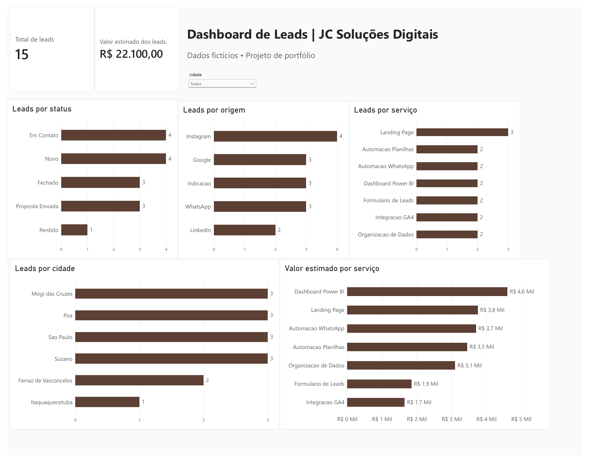

# Laboratório de ETL e Dashboard de Leads | JC Soluções Digitais

Projeto de portfólio de Jéssica Costa com dados fictícios. Demonstra extração de CSV, transformação no SSIS, carga no SQL Server e visualização no Power BI. Os valores representam oportunidades simuladas, sem resultados comerciais reais ou tabela de preços da JC.

## Prévia do dashboard

[Ver a versão em PDF](powerbi/Dashboard_Leads_JC.pdf)

## Fluxo implementado

1. `dados/Leads_JC_Teste.csv`: oito colunas e 15 registros fictícios.
2. `ssis/Package.dtsx`: Origem de Arquivo Simples → Coluna Derivada → Destino OLE DB.
3. A coluna derivada acrescenta `empresa_origem` com o texto `JC Solucoes Digitais`.
4. O destino carrega a tabela `Laboratorio_ETL_JC.dbo.Leads_JC`, com nove colunas e chave primária em `id_lead`.
5. O Power BI apresenta a página “Visão geral dos leads”, com cartões, filtro de cidade e gráficos de leads por status, origem, serviço e cidade, além de valor estimado por serviço.

No SSIS, a transformação acrescenta a identificação da empresa de origem antes da carga no banco. O Power BI reúne os indicadores para explorar a distribuição dos leads e seus valores estimados.

## Arquivos

| Caminho | Finalidade |
| --- | --- |
| `dados/Leads_JC_Teste.csv` | Amostra fictícia de entrada |
| `sql/00_criar_banco.sql` | Preparar o banco em um ambiente novo |
| `sql/01_criar_tabela_Leads_JC.sql` | Estrutura exportada do SSMS em 29/09/2026 |
| `sql/02_conferir_dados.sql` | Consultas de leitura para conferência |
| `ssis/Laboratorio_ETL_SSIS.slnx` | Solução do Visual Studio |
| `ssis/Laboratorio_ETL_SSIS.dtproj` | Projeto Integration Services |
| `ssis/Package.dtsx` | Pacote ETL principal |
| `ssis/Project.params` | Parâmetros do projeto |
| `ssis/Laboratorio_ETL_SSIS.database` | Arquivo auxiliar do projeto |
| `powerbi/Dashboard_Leads_JC.pbix` | Relatório e modelo do Power BI |
| `powerbi/Dashboard_Leads_JC.pdf` | Exportação para apresentação |
| `powerbi/Dashboard_Leads_JC.png` | Prévia para o README |

## Indicadores da amostra

Conferência calculada diretamente do CSV:

- Total: **15 leads**; identificadores únicos de 1001 a 1015.
- Soma dos valores estimados: **R$ 22.100,00**.
- Status: 4 novos, 4 em contato, 3 com proposta enviada, 3 fechados e 1 perdido.

Estes números são referências para conferir a carga e o painel sem filtros. “Valor estimado” não equivale a faturamento recebido.

## Como reproduzir

Requer Windows, SQL Server, SSMS, Visual Studio com suporte a projetos SSIS e Power BI Desktop. O projeto SSIS está configurado com `TargetServerVersion = SQLServer2025`; usar componentes compatíveis ou ajustar o destino e validar antes da execução.

1. Em um ambiente novo, execute `sql/00_criar_banco.sql` e depois `sql/01_criar_tabela_Leads_JC.sql` no SSMS. O segundo script exige que o banco já exista e que a tabela ainda não exista. No ambiente já montado, preserve a tabela existente.
2. Abra a solução ou o projeto na pasta `ssis`.
3. No gerenciador de conexão do arquivo simples, ajuste o caminho para sua cópia de `dados/Leads_JC_Teste.csv`. O pacote original usa um caminho absoluto na pasta Downloads do ambiente de desenvolvimento; a simples cópia dos arquivos não altera essa configuração.
4. Confira a conexão OLE DB: servidor local, banco `Laboratorio_ETL_JC`, autenticação Windows e provedor MSOLEDBSQL19.1 na configuração do pacote. Ajuste para o seu ambiente.
5. Confira os mapeamentos e execute o pacote com a tabela inicialmente vazia. Reexecutar a mesma amostra em uma tabela já carregada pode causar conflito na chave primária; este laboratório não implementa carga incremental.
6. Execute `sql/02_conferir_dados.sql` e compare com os indicadores acima.
7. Abra o PBIX, confira a conexão com seu SQL Server e atualize os dados. Retire filtros para comparar os totais.

## Conferências realizadas e limites

- A amostra contém 15 identificadores únicos e soma R$ 22.100,00 em valores estimados.
- O painel sem filtros apresenta esses mesmos totais.
- Na seleção de Poá, os cartões mostram 3 leads e R$ 3.900,00 estimados, com atualização dos gráficos conferidos.
- A exportação em PDF apresenta o painel completo para consulta.

O laboratório utiliza uma carga inicial de dados fictícios e não implementa carga incremental. Os caminhos e conexões precisam ser ajustados ao reproduzir o projeto em outro computador. Os scripts auxiliares de criação do banco e conferência foram incluídos na documentação e ainda precisam de validação de execução no ambiente local.

## Autoria

Jéssica Costa — Fundadora e Desenvolvedora de Soluções Digitais, JC Soluções Digitais.

Laboratório de aprendizado e portfólio.
